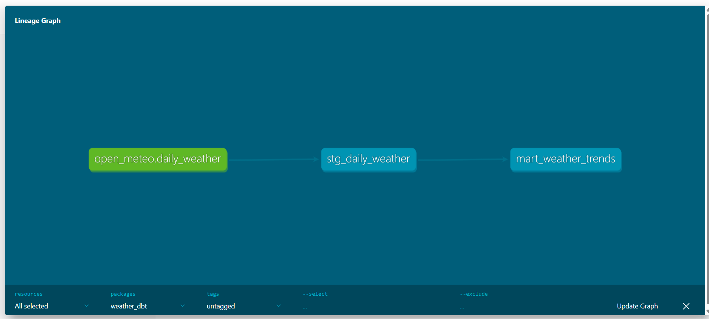

# About

This project pulls the daily weather data from open api named as open-meteo and loads it in raw json format in Google Cloud Storage.

Then the data is flattened and loaded into BigQuery for analytical purposes.

This project is meant to mimic an ELT pipeline used in real world use cases.

# Architecture

`Open-Meteo API → GCS (raw) → BigQuery staging → MERGE → BigQuery final table`

# Key Design Decisions

1. The schema of the table in the BigQuery and their data types
2. Doing incremental refresh using staging table.
3. Using dedup logic and bigquery's MERGE statement for deduplication purposes
4. Saving all the errors in a separate log file along with showing them in the console for future references and debugging purposes.

# How to run

1. Replace the credentials.json path with the json file path for your GCS service account.
2. The service account should have admin level access to BigQuery and GCS.
3. install google cloud, pandas, request

# dbt model

- Create a dbt model that first fetches the data, cleans it and insert it in a staging table. Then using this staging table a cleaned mart table is created in which aggregations is performed.

- Lineage graph for the flow of data created using dbt

- Also created dbt tests on columns for checking non-null values and unqiue values.

# What's next

1. Scheduling it using Apache Airflow.
2. Optimizing it for bigger data.

# Files -

[gcs_to_bigquery_v2.py](gcs_to_bigquery_v2.py)

[to_gcs.py](to_gcs.py)
